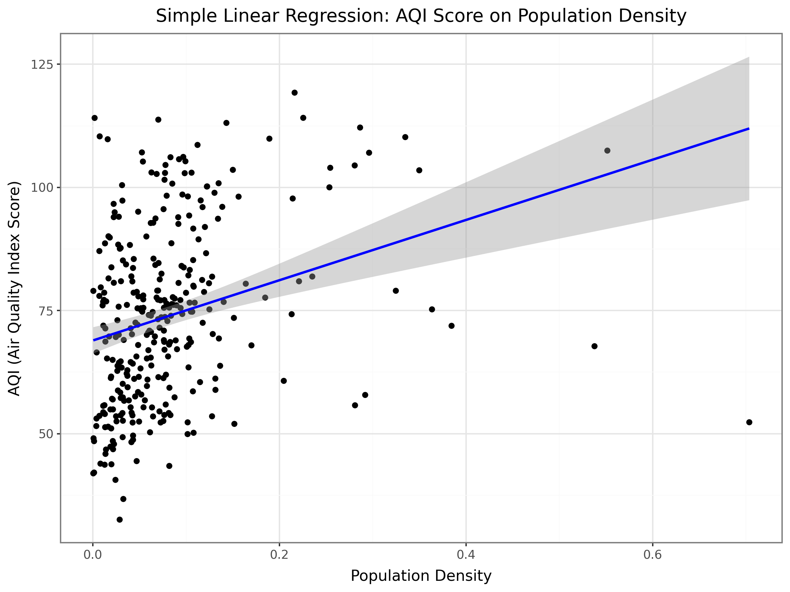
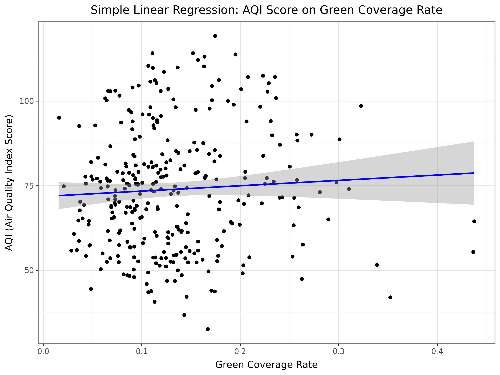
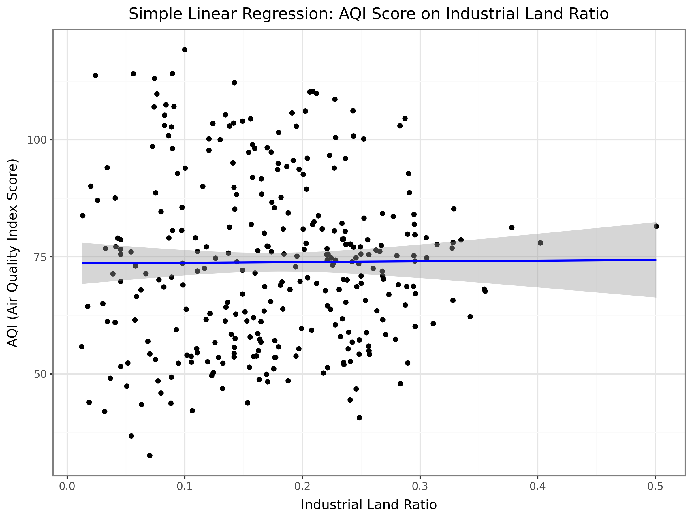
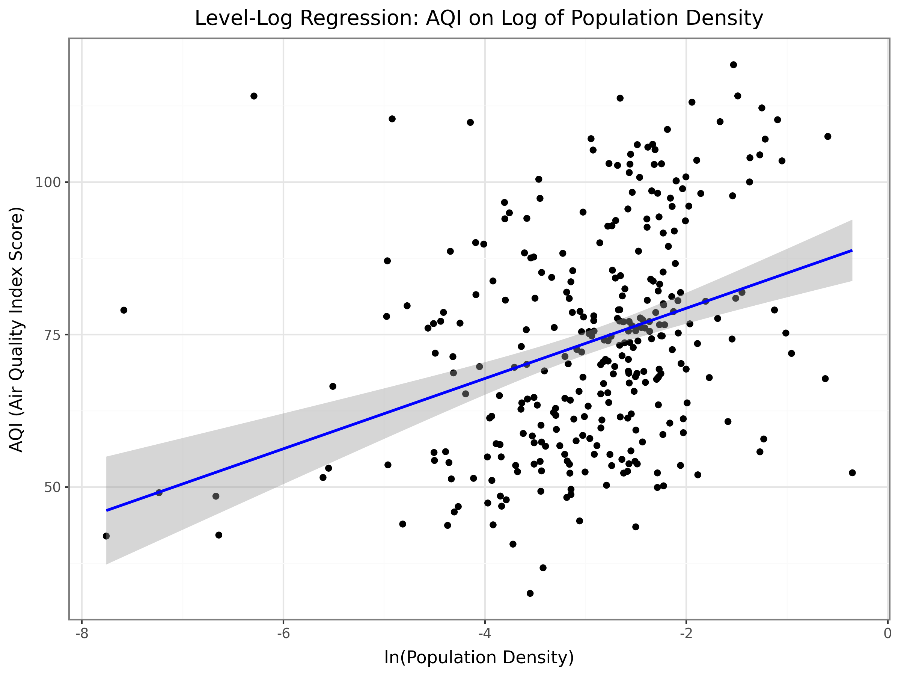
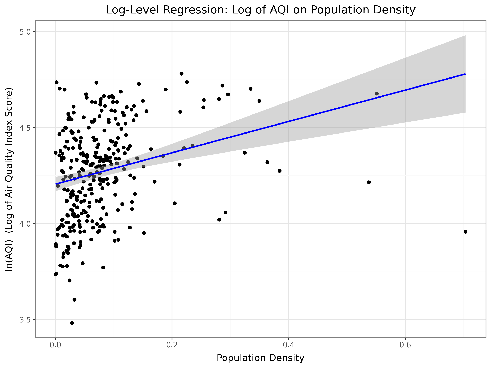
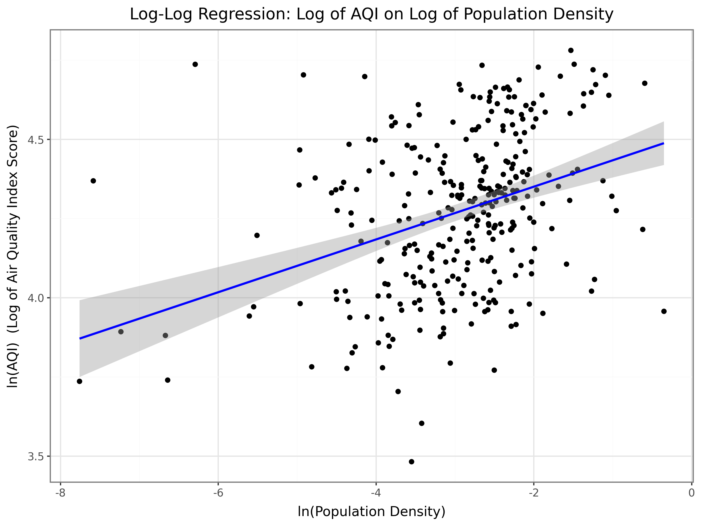
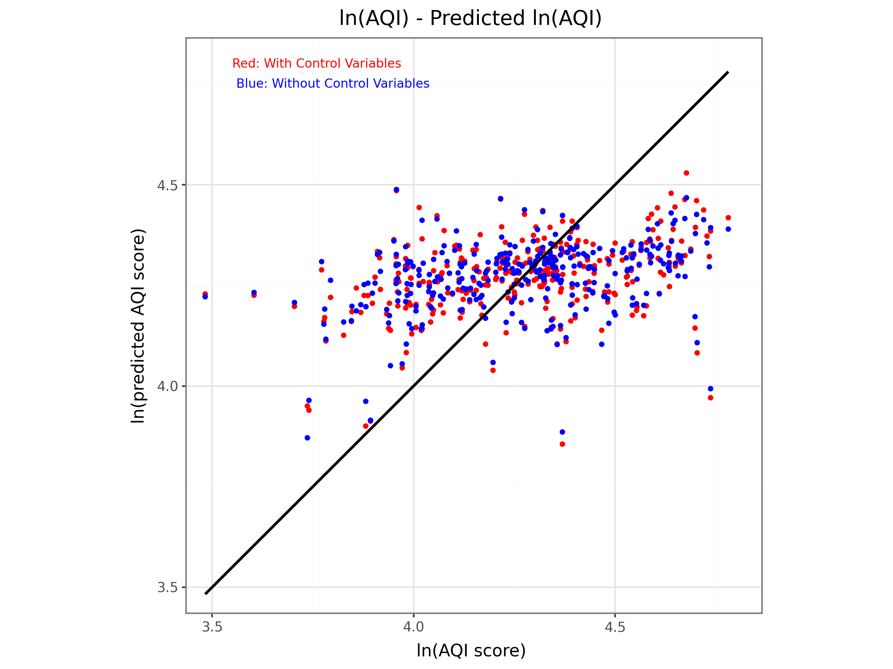
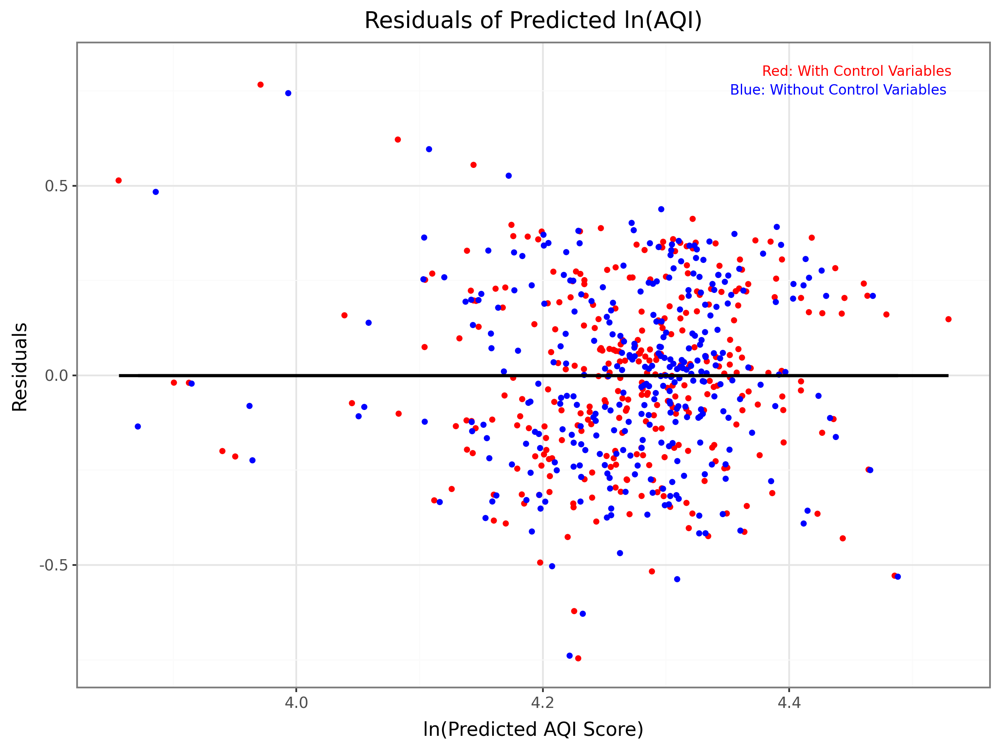

### **Term Project Data Analysis 2 and Assignment 2 Coding 2**

Jiaqi Pan 2500042

----

#### **1. Introduction**

This project is under the topic "Environment and Energy", and focuses on an important environmental and public health issue: urban air pollution. Understanding its causes is essential for effective policy-making and sustainable urban planning. While factors like industrial activity and vehicle emissions are often discussed, the roles of urban form characteristics, including population density and green space provision, are sometimes contested.

Therefore, this project studies the relationship between air pollution levels (measured by AQI) and three key urban variables in Chinese cities: (1) Population Density, (2) Green Coverage Rate, and (3) Industrial Land Ratio. We aim to find out these associations through regression analysis, and assess whether population density has a measurable link with air pollution.

#### **2. Data**

- **AQI-dataset_367_Chinese_cities_2014-2024**: The annual average AQI values for 367 cities across China. The Air Quality Index (AQI) is a comprehensive indicator used to assess air pollution levels, based on the concentrations of six major pollutants: PM2.5, PM10, SO₂, NO₂, O₃, and CO. 
Data Source: https://www.scidb.cn/en/detail?dataSetId=24ca93d08fdf4b9fa12842733caffe6d

- **Urban-area_square-kilometers**: The urban area data of cities across China.

- **Urban-construction-land-area_square-kilometers**: The total area of ​​urban construction land of cities across China, excluding undeveloped land area within the cities.

- **Urban-construction-land-area_Green-space-and-square-area_square-kilometers**: The total area of ​​land used for green spaces and squares within urban construction land. Squares are also included here, as squares typically include large areas of lawns and flowerbeds.

- **Urban-construction-land-area_Industrial-land_square-kilometers**: The total area of ​​industrial land within urban construction land.

- **Urban-population_in-ten-thousand**: The population data of cities across China.

The urban datasets above sourced from the *China Urban Construction Statistical Yearbook*.

- **city_translation**: An additional dataset for the English translations of all city names. The original datasets are downloaded from open websites of the statistical department of the Chinese government, and thus have column names in Chinese. By writing a Python script, we created this dataset as a Chinese-English glossary of Chinese city names, and merged it with all other datasets during the data preparation process.

By merging all datasets, we constructed a cross-sectional dataset including 313 city-level observations of the average values from 2017 to 2021.

#### **3. Model**

**(a) Model Specification and Choice**

We employ Ordinary Least Squares (OLS) regression to estimate the relationship between air pollution and three urban variables. We started with univariate regressions to examine the individual relationships between Air Quality Index (AQI) and each of the three variables (Table 1 and Graph 1-6 in Appendix). The univariate regression models are:

$$
\text{Model 0:  }  AQI^{E}  = β_0 + β_1 PopulationDensity
$$

$$
\text{Model 1:  }  AQI^{E}  = β_0 + β_1 GreenCoverageRate
$$

$$
\text{Model 2:  }  AQI^{E}  = β_0 + β_1  IndustrialLandRatio
$$

$$
\text{Model 3:  }  AQI^{E}  = β_0 + β_1  ln(PopulationDensity)
$$

$$
\text{Model 4:  }  ln(AQI)^{E}  = β_0 + β_1  PopulationDensity
$$

$$
\text{Model 5:  }  ln(AQI)^{E}  = β_0 + β_1  ln(PopulationDensity)
$$

These initial models reveal a significant positive association between population density and AQI. However, their explanatory abilities were limited (R² ≤ 0.08), indicating that a single factor cannot adequately explain air pollution variation.

Therefore, we proceed to multivariate analysis to assess the combined effect of three variables. We compared four key multivariate specifications (Table 2 in Appendix):
$$
\text{Model A:  }  AQI^{E}  = β_0 + β_1 PopulationDensity + β_2  GreenCoverageRate + β_3  IndustrialLandRatio
$$

$$
\text{Model B:  }  AQI^{E}  = β_0 + β_1 PopulationDensity + β_2  GreenCoverageRate + β_3  IndustrialLandRatio
$$

$$
\text{Model C:  }  ln(AQI)^{E}  = β_0 + β_1  ln(PopulationDensity) + β_2  GreenCoverageRate + β_3  IndustrialLandRatio
$$

$$
\text{Model D:  }  ln(AQI)^{E}  = β_0 + β_1  ln(PopulationDensity) + β_2  GreenCoverageRate + β_3  IndustrialLandRatio
$$

After comparing, **Model D** was selected as our primary model for two reasons:
- It achieved the highest explanatory power among the multivariate models (R² = 0.143).
- The log-log transformation suggests a constant-elasticity relationship, which often provides a better fit for economic and environmental variables where proportional changes are more meaningful than absolute changes.

All multivariate models use heteroscedasticity-robust standard errors (HC3) to address potential non-constant error variance.

**(b) Data Preparation and Feature Engineering**

The data preparation pipeline in this project is as follows:

- Initial Assessment: We loaded all datasets and translated Chinese column names to English. Each dataset was merged with city_translation dataset to obtain standardized English city names.
- Missing Value Strategy: We used a missing value heatmap, which showed a large number of missing values in AQI data in year 2014, 2023 and 2024. Therefore, We focused on the 2017-2021 period, which was more relevant and had the most complete coverage across all datasets.
- Data Reshaping: All datasets were converted from wide to long format, then merged using inner joins to create a balanced panel dataset.
- Cross-Section Creation: The panel data was aggregated by city using the mean function, creating our primary cross-sectional dataset of 313 cities.
- Validity Checks: We implemented logical consistency checks (e.g., ensuring industrial land ≤ constructed land ≤ urban land) and removed observations violating these conditions.
- Outlier Treatment: Extreme AQI values were retained as they represent real cases of severe pollution rather than measurement errors.
- Using these datasets, we calculate the following three variables:$$
\text{Explanatory Variable X: Population Density} = \frac{\text{Population}}{\text{Urban area}}
$$

$$
\text{Control Variable Z1: Green Coverage Rate} = \frac{\text{Total area of green spaces and squares}}{\text{Total area of urban construction land}}
$$

$$
\text{Control Variable Z2: Industrial land ratio} = \frac{\text{Industrial land area}}{\text{Total area of ​​urban construction land}}
$$
- For robustness checks, we also created binary categories of Green Coverage Rate and Industrial Land Ratio (1 if above mean, 0 otherwise).

**(c) Core Results and Interpretation**

**Univariate Regression Analysis (Table 1 in Appendix):**

Simple regressions establish baseline relationships. The linear regression of **AQI** on **Population Density** indicates a clear positive relationship (coefficient = 61.181, p < 0.01). However, R² = 0.080 indicates that population density alone explains a very small portion of the variation in AQI. This result is reasonable, as air pollution levels are influenced by multiple factors such as climate, geography, ecological conditions, and energy sources, which I didn't include in this project because of lack of data. Since all models in this project consider no more than three variables, their explanatory power is naturally limited.

In contrast, the linear regressions of **AQI** on **Green Coverage Rate** and **Industrial Land Ratio** show that these variables are mostly uncorrelated with air pollution levels when considered alone (p > 0.1, R² ≈ 0). This is also evident in the scatter plots, where the fitted linear trend lines are almost completely flat. These findings seem to suggest that, based solely on these data, large investments in urban green spaces may not have a measurable impact on air quality. However, it is also important to note that causal interpretations cannot be drawn definitively due to the absence of many potential confounding variables. Also, the overall industrial emissions in Chinese cities may be low due to strict regulatory controls, which could possibly explain why there isn't an observable impact of industrial land ratio on AQI. 

Through applying **log-transformations** to **AQI** and **Population Density**, the R-squared values of models improved, with the highest R-squared in the log-log transformation model. However, we cannot directly conclude that the log-log transformation model is still the best with control variables.

**Multivariate Regression Analysis (Table 2 in Appendix):**

Our preferred Model D demonstrates the best fit. A 1% increase in population density is associated with a 0.090% increase in AQI (β = 0.090, p < 0.01). This relationship is statistically significant and robust across specifications.

An unexpected finding in this model is that, Green Coverage Rate shows a positive and statistically significant coefficient (β = 0.570, p < 0.05). Does this imply that creating green space increases pollution? I would say, not necessarily. Given the generally low values and limited variation of this variable in our sample (typically ranging from 0.00 to 0.15), so multiplying it by 0.570 has minimal influence on the AQI expectation value. We would still conclude that this statistical significance likely reflects confounding factors rather than a meaningful causal relationship.

#### **4. Robustness and Sensitivity Analysis**

To see if the positive relationship between AQI and Population Density is a stable result, we compared three models: Model D, Model 5 and Model D1 (Table 3 in Appendix).

- We compared the primary model including control variables (Model D from Table 2) with a simpler log-log model that only includes population density as explanatory variable (Model 5 in Table 1). The coefficients for population density in both models stayed almost the same (0.090 vs. 0.083). When including control variables, the explanatory power of Model D is only marginally improved compared to Model 5 without control variables, with an increase in R-squared of 0.018, which is practically insignificant. This finding aligns with previous results indicating that Green Coverage Rate and Industrial Land Ratio have almost no linear correlation with AQI. 
- We checked if using binary categories to measure green space and industrial land would change the result. Instead of using the exact percentage, we created simple *High* and *Low* categories for the two control variables (1 if above mean, 0 otherwise) (Model D1 in Table 3): $$\text{Model D1:   } ln(AQI)^{E}  = β_0 + β_1  ln(PopulationDensity) + β_2  D_{GreenCoverageRate} + β_3  D_{IndustrialLandRatio}$$In Model D1, neither Green Coverage Rate nor Industrial Land Ratio had a significant effect on pollution. The coefficients for these grouping variables are very small (0.044 and 0.008), and their standard errors are relatively large. This again confirms that these two factors are not strong predictors in our data.
- We used the ŷ-y plot and the residual plot (Graph 7 and Graph 8 in Appendix) to compare the prediction errors of the primary model with all three variables (Model D) and the model without control variables (Model 5). In both plots, it's impossible to determine whether the model's prediction performance is better with control variables simply by observation, because the scatter points deviate from the straight line to roughly the same degree. This conclusion aligns with the previous finding: with control variables, the model's R-squared only increases by 0.018, resulting in almost identical fitting performance.

In conclusion, the positive relationship between population density and AQI is stable with and without control variables. The effects of green coverage and industrial land ratio are consistently weak and not reliable across different tests.

#### **5. Causal Interpretation and Main Summary**

The regression analysis shows that population density has a robust positive association with higher AQI, consistent across model specifications. Green Coverage Rate and Industrial Land Ratio show no robust linear relationship with AQI in the cross-sectional analysis.

While the association for population density is strong, a causal interpretation requires caution. Unobserved confounders such as transportation patterns could bias our estimate. For example, dense cities might have more cars, different types of industry, or specific weather patterns that trap pollution. 

Additionaly, the positive coefficient we found between Green Coverage Rate and AQI might seem confusing, but there can be a few possible reasons for this. Cities with more green space rate may also be larger, wealthier, or have other unmeasured pollution sources. The green space measure in the data also includes square areas and may not fully show whether the vegetation is spread evenly. 

Overall, we would conclude that while the model shows a positive relationship, it does not prove that higher urban green coverage rate can definitely lead to a higher AQI score.

#### **6. Conclusion and Policy Implications**

This study confirms that higher population density is a key factor associated with worse air quality in Chinese cities. However, we cannot prove that a higher percentage of green space or industrial land in a city is linked to its overall air pollution levels.

Policymakers should recognize the inherent air quality challenges of high population density and prioritize urban planning. Although investments in green space are valuable for recreation, our results suggest they should not be treated as a major tool for reducing city-wide air pollution. The focus for air quality improvement should remain on managing pollution sources.

### **Appendix**

**Tables:**
- Table 1: Univariate Regression Models
  

<table border="1" style="width:100%; border-collapse: collapse;">
<thead>
    <tr>
        <td style="border-top: 3px double black; border-bottom: 1px solid black;"></td>
        <td colspan="6" style="border-top: 3px double black; border-bottom: 1px solid black; text-align: center;"></td>
    </tr>
    <tr>
        <td style="text-align: left;"></td>
        <td style="text-align: center;">Model 0 AQI on Population Density</td>
        <td style="text-align: center;">Model 1 AQI on Green Coverage Rate</td>
        <td style="text-align: center;">Model 2 AQI on Industrial Land Ratio</td>
        <td style="text-align: center;">Model 3 AQI on ln(Population Density)</td>
        <td style="text-align: center;">Model 4 ln(AQI) on Population Density</td>
        <td style="text-align: center;">Model 5 ln(AQI) on ln(Population Density)</td>
    </tr>
</thead>
<tbody>
    <tr><td>&nbsp;</td><td>&nbsp;</td><td>&nbsp;</td><td>&nbsp;</td><td>&nbsp;</td><td>&nbsp;</td><td>&nbsp;</td></tr>
    <tr>
        <td>Intercept</td>
        <td style="text-align: center;">68.926***</td>
        <td style="text-align: center;">71.781***</td>
        <td style="text-align: center;">73.587***</td>
        <td style="text-align: center;">90.836***</td>
        <td style="text-align: center;">4.206***</td>
        <td style="text-align: center;">4.518***</td>
    </tr>
    <tr>
        <td></td>
        <td style="text-align: center;">(1.362)</td>
        <td style="text-align: center;">(2.234)</td>
        <td style="text-align: center;">(2.381)</td>
        <td style="text-align: center;">(2.856)</td>
        <td style="text-align: center;">(0.019)</td>
        <td style="text-align: center;">(0.039)</td>
    </tr>
    <tr>
        <td>Population Density</td>
        <td style="text-align: center;">61.181***</td>
        <td></td><td></td><td></td>
        <td style="text-align: center;">0.816***</td>
        <td></td>
    </tr>
    <tr>
        <td></td>
        <td style="text-align: center;">(11.782)</td>
        <td></td><td></td><td></td>
        <td style="text-align: center;">(0.163)</td>
        <td></td>
    </tr>
    <tr>
        <td>ln(Population Density)</td>
        <td></td><td></td><td></td>
        <td style="text-align: center;">5.762***</td>
        <td></td>
        <td style="text-align: center;">0.083***</td>
    </tr>
    <tr>
        <td></td>
        <td></td><td></td><td></td>
        <td style="text-align: center;">(0.913)</td>
        <td></td>
        <td style="text-align: center;">(0.013)</td>
    </tr>
    <tr>
        <td>Green Coverage Rate</td>
        <td></td>
        <td style="text-align: center;">15.818</td>
        <td></td><td></td><td></td><td></td>
    </tr>
    <tr>
        <td></td>
        <td></td>
        <td style="text-align: center;">(15.168)</td>
        <td></td><td></td><td></td><td></td>
    </tr>
    <tr>
        <td>Industrial Land Ratio</td>
        <td></td><td></td>
        <td style="text-align: center;">1.530</td>
        <td></td><td></td><td></td>
    </tr>
    <tr>
        <td></td>
        <td></td><td></td>
        <td style="text-align: center;">(12.211)</td>
        <td></td><td></td><td></td>
    </tr>
    <tr><td colspan="7" style="border-top: 1px solid black;">&nbsp;</td></tr>
    <tr>
        <td>Observations</td>
        <td style="text-align: center;">313</td>
        <td style="text-align: center;">313</td>
        <td style="text-align: center;">313</td>
        <td style="text-align: center;">313</td>
        <td style="text-align: center;">313</td>
        <td style="text-align: center;">313</td>
    </tr>
    <tr>
        <td>R²</td>
        <td style="text-align: center;">0.080</td>
        <td style="text-align: center;">0.003</td>
        <td style="text-align: center;">0.000</td>
        <td style="text-align: center;">0.114</td>
        <td style="text-align: center;">0.075</td>
        <td style="text-align: center;">0.125</td>
    </tr>
    <tr>
        <td>Adjusted R²</td>
        <td style="text-align: center;">0.077</td>
        <td style="text-align: center;">0.000</td>
        <td style="text-align: center;">-0.003</td>
        <td style="text-align: center;">0.111</td>
        <td style="text-align: center;">0.072</td>
        <td style="text-align: center;">0.122</td>
    </tr>
    <tr>
        <td>Residual Std. Error</td>
        <td style="text-align: center;">17.270 (df=311)</td>
        <td style="text-align: center;">17.972 (df=311)</td>
        <td style="text-align: center;">18.003 (df=311)</td>
        <td style="text-align: center;">16.950 (df=311)</td>
        <td style="text-align: center;">0.239 (df=311)</td>
        <td style="text-align: center;">0.232 (df=311)</td>
    </tr>
    <tr>
        <td>F Statistic</td>
        <td style="text-align: center;">26.963*** (df=1; 311)</td>
        <td style="text-align: center;">1.088 (df=1; 311)</td>
        <td style="text-align: center;">0.016 (df=1; 311)</td>
        <td style="text-align: center;">39.843*** (df=1; 311)</td>
        <td style="text-align: center;">25.070*** (df=1; 311)</td>
        <td style="text-align: center;">44.362*** (df=1; 311)</td>
    </tr>
    <tr><td colspan="7" style="border-top: 3px double black; border-bottom: 1px solid black;">&nbsp;</td></tr>
    <tr>
        <td colspan="7" style="text-align: right;"><i>Note:</i> *p<0.1; **p<0.05; ***p<0.01</td>
    </tr>
</tbody>
</table>

- Table 2: Multivariate Regression Models with Different Transformations

<table border="1" style="width:100%; border-collapse: collapse;">
<thead>
    <tr>
        <td style="border-top: 3px double black; border-bottom: 1px solid black;"></td>
        <td colspan="4" style="border-top: 3px double black; border-bottom: 1px solid black; text-align: center;"></td>
    </tr>
    <tr>
        <td style="text-align: left;"></td>
        <td style="text-align: center;">Model A AQI on Pop. Density, Green Coverage Rate, and Industrial Land Ratio</td>
        <td style="text-align: center;">Model B AQI on Log of Pop. Density, Green Coverage Rate, and Industrial Land Ratio</td>
        <td style="text-align: center;">Model C Log of AQI on Pop. Density, Green Coverage Rate, and Industrial Land Ratio</td>
        <td style="text-align: center;">Model D Log of AQI on Log of Pop. Density, Green Coverage Rate, and Industrial Land Ratio</td>
    </tr>
</thead>
<tbody>
    <tr><td>&nbsp;</td><td>&nbsp;</td><td>&nbsp;</td><td>&nbsp;</td><td>&nbsp;</td></tr>
    <tr>
        <td>Intercept</td>
        <td style="text-align: center;">63.271***</td>
        <td style="text-align: center;">88.479***</td>
        <td style="text-align: center;">4.100***</td>
        <td style="text-align: center;">4.449***</td>
    </tr>
    <tr>
        <td></td>
        <td style="text-align: center;">(5.249)</td>
        <td style="text-align: center;">(5.927)</td>
        <td style="text-align: center;">(0.073)</td>
        <td style="text-align: center;">(0.081)</td>
    </tr>
    <tr>
        <td>Population Density</td>
        <td style="text-align: center;">63.240**</td>
        <td></td>
        <td style="text-align: center;">0.829**</td>
        <td></td>
    </tr>
    <tr>
        <td></td>
        <td style="text-align: center;">(25.066)</td>
        <td></td>
        <td style="text-align: center;">(0.340)</td>
        <td></td>
    </tr>
    <tr>
        <td>ln(Population Density)</td>
        <td></td>
        <td style="text-align: center;">6.463***</td>
        <td></td>
        <td style="text-align: center;">0.090***</td>
    </tr>
    <tr>
        <td></td>
        <td></td>
        <td style="text-align: center;">(1.229)</td>
        <td></td>
        <td style="text-align: center;">(0.017)</td>
    </tr>
    <tr>
        <td>Green Coverage Rate</td>
        <td style="text-align: center;">31.127</td>
        <td style="text-align: center;">38.621**</td>
        <td style="text-align: center;">0.460*</td>
        <td style="text-align: center;">0.570**</td>
    </tr>
    <tr>
        <td></td>
        <td style="text-align: center;">(18.943)</td>
        <td style="text-align: center;">(19.339)</td>
        <td style="text-align: center;">(0.264)</td>
        <td style="text-align: center;">(0.265)</td>
    </tr>
    <tr>
        <td>Industrial Land Ratio</td>
        <td style="text-align: center;">7.978</td>
        <td style="text-align: center;">-3.650</td>
        <td style="text-align: center;">0.254</td>
        <td style="text-align: center;">0.086</td>
    </tr>
    <tr>
        <td></td>
        <td style="text-align: center;">(14.223)</td>
        <td style="text-align: center;">(15.261)</td>
        <td style="text-align: center;">(0.198)</td>
        <td style="text-align: center;">(0.211)</td>
    </tr>
    <tr><td colspan="5" style="border-top: 1px solid black;">&nbsp;</td></tr>
    <tr>
        <td>Observations</td>
        <td style="text-align: center;">313</td>
        <td style="text-align: center;">313</td>
        <td style="text-align: center;">313</td>
        <td style="text-align: center;">313</td>
    </tr>
    <tr>
        <td>R²</td>
        <td style="text-align: center;">0.090</td>
        <td style="text-align: center;">0.136</td>
        <td style="text-align: center;">0.085</td>
        <td style="text-align: center;">0.143</td>
    </tr>
    <tr>
        <td>Adjusted R²</td>
        <td style="text-align: center;">0.081</td>
        <td style="text-align: center;">0.127</td>
        <td style="text-align: center;">0.076</td>
        <td style="text-align: center;">0.135</td>
    </tr>
    <tr>
        <td>Residual Std. Error</td>
        <td style="text-align: center;">17.234 (df=309)</td>
        <td style="text-align: center;">16.791 (df=309)</td>
        <td style="text-align: center;">0.238 (df=309)</td>
        <td style="text-align: center;">0.230 (df=309)</td>
    </tr>
    <tr>
        <td>F Statistic</td>
        <td style="text-align: center;">2.946** (df=3; 309)</td>
        <td style="text-align: center;">9.572*** (df=3; 309)</td>
        <td style="text-align: center;">2.758** (df=3; 309)</td>
        <td style="text-align: center;">10.188*** (df=3; 309)</td>
    </tr>
    <tr><td colspan="5" style="border-top: 3px double black; border-bottom: 1px solid black;">&nbsp;</td></tr>
    <tr>
        <td colspan="5" style="text-align: right;"><i>Note:</i> *p<0.1; **p<0.05; ***p<0.01</td>
    </tr>
</tbody>
</table>

- Table 3: Robustness Checks and Alternative Specifications

<table border="1" style="width:100%; border-collapse: collapse;">
<thead>
    <tr>
        <td style="border-top: 3px double black; border-bottom: 1px solid black;"></td>
        <td colspan="3" style="border-top: 3px double black; border-bottom: 1px solid black; text-align: center;"><i></i></td>
    </tr>
    <tr>
        <td style="text-align: left;"></td>
        <td style="text-align: center;">Model D ln(AQI) on ln(Pop. Density), Green Coverage Rate, and Industrial Land Ratio</td>
        <td style="text-align: center;">Model 5 ln(AQI) on only ln(Population Density)</td>
        <td style="text-align: center;">Model D1 ln(AQI) on ln(Pop. Density), if Green Coverage Rate is high, and if Industrial Land Ratio is high</td>
    </tr>
</thead>
<tbody>
    <tr><td>&nbsp;</td><td>&nbsp;</td><td>&nbsp;</td><td>&nbsp;</td></tr>
    <tr>
        <td>Intercept</td>
        <td style="text-align: center;">4.449***</td>
        <td style="text-align: center;">4.518***</td>
        <td style="text-align: center;">4.505***</td>
    </tr>
    <tr>
        <td></td>
        <td style="text-align: center;">(0.081)</td>
        <td style="text-align: center;">(0.039)</td>
        <td style="text-align: center;">(0.056)</td>
    </tr>
    <tr>
        <td>ln(Population Density)</td>
        <td style="text-align: center;">0.090***</td>
        <td style="text-align: center;">0.083***</td>
        <td style="text-align: center;">0.087***</td>
    </tr>
    <tr>
        <td></td>
        <td style="text-align: center;">(0.017)</td>
        <td style="text-align: center;">(0.013)</td>
        <td style="text-align: center;">(0.016)</td>
    </tr>
    <tr>
        <td>Green Coverage Rate</td>
        <td style="text-align: center;">0.570**</td>
        <td></td><td></td>
    </tr>
    <tr>
        <td></td>
        <td style="text-align: center;">(0.265)</td>
        <td></td><td></td>
    </tr>
    <tr>
        <td>Industrial Land Ratio</td>
        <td style="text-align: center;">0.086</td>
        <td></td><td></td>
    </tr>
    <tr>
        <td></td>
        <td style="text-align: center;">(0.211)</td>
        <td></td><td></td>
    </tr>
    <tr>
        <td>1 when Green Coverage Rate is High</td>
        <td></td><td></td>
        <td style="text-align: center;">0.044</td>
    </tr>
    <tr>
        <td></td>
        <td></td><td></td>
        <td style="text-align: center;">(0.031)</td>
    </tr>
    <tr>
        <td>1 when Industrial Land Ratio is High</td>
        <td></td><td></td>
        <td style="text-align: center;">0.008</td>
    </tr>
    <tr>
        <td></td>
        <td></td><td></td>
        <td style="text-align: center;">(0.030)</td>
    </tr>
    <tr><td colspan="4" style="border-top: 1px solid black;">&nbsp;</td></tr>
    <tr>
        <td>Observations</td>
        <td style="text-align: center;">313</td>
        <td style="text-align: center;">313</td>
        <td style="text-align: center;">313</td>
    </tr>
    <tr>
        <td>R²</td>
        <td style="text-align: center;">0.143</td>
        <td style="text-align: center;">0.125</td>
        <td style="text-align: center;">0.131</td>
    </tr>
    <tr>
        <td>Adjusted R²</td>
        <td style="text-align: center;">0.135</td>
        <td style="text-align: center;">0.122</td>
        <td style="text-align: center;">0.123</td>
    </tr>
    <tr>
        <td>Residual Std. Error</td>
        <td style="text-align: center;">0.230 (df=309)</td>
        <td style="text-align: center;">0.232 (df=311)</td>
        <td style="text-align: center;">0.232 (df=309)</td>
    </tr>
    <tr>
        <td>F Statistic</td>
        <td style="text-align: center;">10.188*** (df=3; 309)</td>
        <td style="text-align: center;">44.362*** (df=1; 311)</td>
        <td style="text-align: center;">10.398*** (df=3; 309)</td>
    </tr>
    <tr><td colspan="4" style="border-top: 3px double black; border-bottom: 1px solid black;">&nbsp;</td></tr>
    <tr>
        <td colspan="4" style="text-align: right;"><i>Note:</i> *p<0.1; **p<0.05; ***p<0.01</td>
    </tr>
</tbody>
</table>

**Graphs:**

- Graph 1
  

- Graph 2

- Graph 3

- Graph 4

- Graph 5

- Graph 6

- Graph 7

- Graph 8

